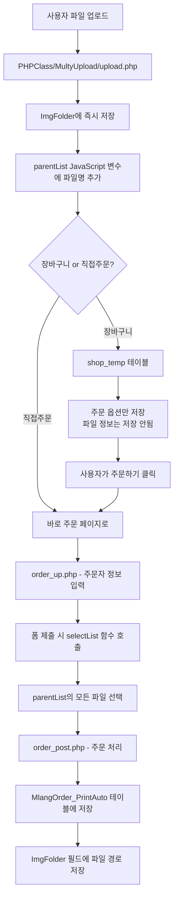
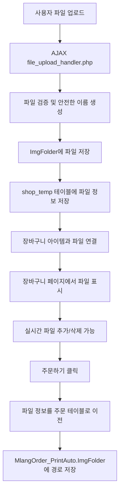
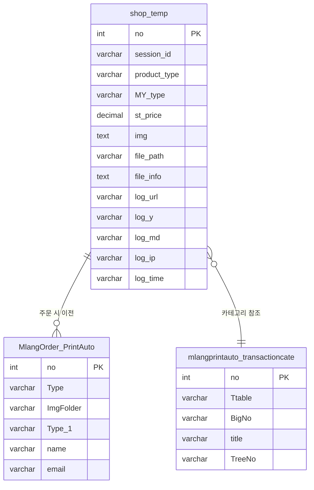

# 📎 파일업로드 시스템 완전 정리

## 📅 작성일: 2025년 8월 4일

---

## 🎯 개요

인쇄 자동화 시스템의 파일 업로드 구조를 완전히 분석하고, 기존 시스템의 문제점을 해결하는 통합 파일 관리 시스템을 설계했습니다.

---

## 📊 기존 시스템 분석

### 🔍 현재 파일 업로드 구조

#### **1. 물리적 저장 위치**
```
ImgFolder/
└── {페이지명}/          # 예: msticker, ncrflambeau, littleprint
    └── {연도}/          # 예: 2025
        └── {월일}/      # 예: 0804
            └── {IP주소}/    # 예: 127.0.0.1
                └── {타임스탬프}/  # 예: 1691234567
                    ├── design.jpg
                    ├── sample.pdf
                    └── logo.ai
```

#### **2. 기존 업로드 플로우**


#### **3. 기존 시스템의 핵심 파일들**
```
PHPClass/MultyUpload/
├── FileUp.php          # 파일 업로드 메인 페이지 (팝업)
├── upload.php          # 실제 업로드 처리
├── FileDelete.php      # 파일 삭제 처리
├── Form.php           # 업로드 폼
└── FormOk.php         # 업로드 완료 처리
```

### 🚨 기존 시스템의 문제점

#### **1. 장바구니와 파일 분리**
- **문제**: shop_temp 테이블에 파일 정보가 저장되지 않음
- **결과**: 파일과 주문 정보가 분리되어 관리됨
- **위험**: 브라우저 새로고침 시 파일 목록 손실

#### **2. 클라이언트 의존성**
- **문제**: parentList JavaScript 변수로만 파일 관리
- **결과**: 세션 불안정성, 데이터 손실 위험
- **제약**: 서버 사이드에서 파일 정보 접근 불가

#### **3. 수동 연결 방식**
- **문제**: 주문 완료 시에만 파일과 주문이 연결됨
- **결과**: 중간 단계에서 파일 관리 어려움
- **한계**: 실시간 파일 추가/삭제 불가능

---

## 🔧 개선된 파일 업로드 시스템

### 📋 **1. shop_temp 테이블 구조 확장**

#### **기존 구조**
```sql
CREATE TABLE `shop_temp` (
  `no` int(11) NOT NULL AUTO_INCREMENT,
  `session_id` varchar(100) NOT NULL,
  `product_type` varchar(50) NOT NULL,
  `MY_type` varchar(50) DEFAULT NULL,
  `st_price` decimal(10,2) DEFAULT 0.00,
  `img` varchar(200) DEFAULT NULL,  -- 기존: 단일 파일명만
  -- 기타 필드들...
);
```

#### **개선된 구조**
```sql
ALTER TABLE `shop_temp` 
  -- 기존 img 필드 확장
  MODIFY COLUMN `img` TEXT DEFAULT NULL COMMENT '업로드된 파일명들 (콤마 구분)',
  
  -- 파일 관리 필드 추가
  ADD COLUMN `file_path` VARCHAR(500) DEFAULT NULL COMMENT '파일 저장 경로',
  ADD COLUMN `file_info` TEXT DEFAULT NULL COMMENT '파일 상세 정보 (JSON)',
  ADD COLUMN `upload_log` TEXT DEFAULT NULL COMMENT '업로드 로그 정보',
  
  -- 로그 정보 필드 (기존 시스템 호환)
  ADD COLUMN `log_url` VARCHAR(100) DEFAULT NULL COMMENT '페이지 구분자',
  ADD COLUMN `log_y` VARCHAR(10) DEFAULT NULL COMMENT '연도',
  ADD COLUMN `log_md` VARCHAR(10) DEFAULT NULL COMMENT '월일',
  ADD COLUMN `log_ip` VARCHAR(50) DEFAULT NULL COMMENT 'IP 주소',
  ADD COLUMN `log_time` VARCHAR(20) DEFAULT NULL COMMENT '타임스탬프';
```

### 🗂️ **2. 파일 정보 저장 구조**

#### **file_info 필드 JSON 구조**
```json
[
  {
    "original_name": "design.jpg",
    "saved_name": "design_20250804_001.jpg",
    "file_size": 1024000,
    "file_type": "image/jpeg",
    "upload_time": 1691234567,
    "upload_path": "ImgFolder/msticker/2025/0804/127.0.0.1/1691234567/design_20250804_001.jpg"
  },
  {
    "original_name": "logo.pdf",
    "saved_name": "logo_20250804_002.pdf",
    "file_size": 2048000,
    "file_type": "application/pdf",
    "upload_time": 1691234568,
    "upload_path": "ImgFolder/msticker/2025/0804/127.0.0.1/1691234567/logo_20250804_002.pdf"
  }
]
```

#### **img 필드 호환성 유지**
```
기존 방식: "design.jpg"
새로운 방식: "design_20250804_001.jpg,logo_20250804_002.pdf"
```

### 🔄 **3. 새로운 파일 업로드 플로우**



---

## 🛠️ 구현된 파일 관리 시스템

### 📁 **핵심 파일 구조**

```
MlangPrintAuto/shop/
├── upgrade_shop_temp_for_files.sql     # 테이블 구조 업그레이드 SQL
├── file_management_helper.php          # 파일 관리 핵심 함수들
├── file_upload_handler.php             # AJAX 파일 업로드 처리
├── file_delete_handler.php             # AJAX 파일 삭제 처리
├── get_cart_files.php                  # 장바구니 파일 목록 조회
├── upgrade_add_to_basket_example.php   # 장바구니 추가 예시 (파일 포함)
└── upgrade_cart_display_example.php    # 장바구니 표시 예시 (파일 포함)

includes/
└── file_upload_component.php           # 공통 파일 업로드 컴포넌트
```

### 🔧 **주요 함수들**

#### **1. 파일 관리 핵심 함수 (file_management_helper.php)**

```php
// 장바구니 아이템에 파일 정보 추가
addFileToCartItem($connect, $cart_item_no, $file_info, $log_info)

// 장바구니 아이템의 파일 목록 조회
getCartItemFiles($connect, $cart_item_no)

// 장바구니 아이템에서 특정 파일 삭제
removeFileFromCartItem($connect, $cart_item_no, $file_name)

// 세션의 모든 장바구니 아이템 파일 정보 조회
getCartItemsWithFiles($connect, $session_id)

// 주문 완료 시 파일 정보를 주문 테이블로 이전
transferFilesToOrder($connect, $session_id, $order_id)

// 파일 업로드 디렉토리 생성
createFileUploadDirectory($log_info)
```

#### **2. AJAX 처리 함수들**

**파일 업로드 (file_upload_handler.php)**
```php
POST /MlangPrintAuto/shop/file_upload_handler.php
Parameters:
- cart_item_no: 장바구니 아이템 번호
- product_type: 상품 유형
- files[]: 업로드할 파일들

Response:
{
    "success": true,
    "data": {
        "uploaded_files": [...],
        "total_count": 2,
        "cart_item_no": 123
    }
}
```

**파일 삭제 (file_delete_handler.php)**
```php
POST /MlangPrintAuto/shop/file_delete_handler.php
Content-Type: application/json

Body:
{
    "cart_item_no": 123,
    "file_name": "design_20250804_001.jpg"
}

Response:
{
    "success": true,
    "message": "파일이 성공적으로 삭제되었습니다."
}
```

### 🎨 **공통 파일 업로드 컴포넌트**

#### **사용법**
```php
<?php
// 로그 정보 생성
$log_info = generateLogInfo();

// 파일 업로드 컴포넌트 렌더링
include "../../includes/file_upload_component.php";
renderFileUploadComponent($log_info, 'msticker', [
    'title' => '📎 디자인 파일 첨부',
    'max_files' => 10,
    'max_file_size' => 50 * 1024 * 1024,
    'allowed_types' => ['jpg', 'jpeg', 'png', 'pdf', 'ai', 'psd']
]);
?>
```

#### **기능**
- ✅ **드래그 앤 드롭 지원**
- ✅ **다중 파일 업로드**
- ✅ **실시간 미리보기**
- ✅ **파일 타입 검증**
- ✅ **파일 크기 제한**
- ✅ **기존 시스템 호환** (parentList 방식 병행)

---

## 📊 데이터베이스 구조 상세

### 🗄️ **테이블 관계도**



### 📋 **데이터 예시**

#### **shop_temp 테이블 데이터**
```sql
INSERT INTO shop_temp (
    no, session_id, product_type, MY_type, MY_Fsd, MY_amount,
    st_price, st_price_vat, img, file_info, file_path,
    log_url, log_y, log_md, log_ip, log_time
) VALUES (
    1, 'sess_abc123', 'msticker', '742', '743', '1000',
    20000, 22000, 
    'design_001.jpg,logo_002.pdf',
    '[{"original_name":"design.jpg","saved_name":"design_001.jpg",...}]',
    'msticker/2025/0804/127.0.0.1/1691234567',
    'msticker', '2025', '0804', '127.0.0.1', '1691234567'
);
```

#### **MlangOrder_PrintAuto 테이블 데이터**
```sql
INSERT INTO MlangOrder_PrintAuto (
    Type, ImgFolder, Type_1, name, email, phone
) VALUES (
    '자석스티커', 
    'msticker/2025/0804/127.0.0.1/1691234567',
    '자석스티커 90x60mm 1000매',
    '홍길동', 'test@example.com', '010-1234-5678'
);
```

---

## 🔄 시스템 통합 방안

### 📈 **단계별 적용 계획**

#### **1단계: 테이블 구조 업그레이드**
```bash
# 1. 기존 데이터 백업
CREATE TABLE shop_temp_backup AS SELECT * FROM shop_temp;

# 2. 테이블 구조 업그레이드
SOURCE MlangPrintAuto/shop/upgrade_shop_temp_for_files.sql;

# 3. 업그레이드 확인
DESCRIBE shop_temp;
```

#### **2단계: 파일 관리 시스템 배포**
```bash
# 파일 복사
cp MlangPrintAuto/shop/file_*.php /server/path/
cp includes/file_upload_component.php /server/path/

# 권한 설정
chmod 755 MlangPrintAuto/shop/file_*.php
chmod 755 includes/file_upload_component.php
```

#### **3단계: 기존 코드 점진적 업그레이드**

**기존 add_to_basket.php 수정 예시:**
```php
// 기존 코드
if (addMstickerToCart($db, $session_id, $cart_data)) {
    success_response(['message' => '장바구니에 추가되었습니다.']);
}

// 새로운 코드 (파일 지원)
if ($cart_item_no = addMstickerToCart($db, $session_id, $cart_data)) {
    // 파일 업로드 처리
    $uploaded_files = [];
    if (isset($_FILES['files'])) {
        $uploaded_files = handleFileUpload($db, $cart_item_no, $_FILES['files']);
    }
    
    success_response([
        'cart_item_no' => $cart_item_no,
        'uploaded_files' => $uploaded_files,
        'message' => '장바구니에 추가되었습니다.'
    ]);
}
```

### 🔀 **호환성 유지 전략**

#### **1. 기존 parentList 방식 병행**
```javascript
// 기존 방식 (팝업)
function uploadFileLegacy() {
    const url = `../../PHPClass/MultyUpload/FileUp.php?...`;
    window.open(url, 'FileUpload', 'width=500,height=400');
}

// 새로운 방식 (AJAX)
function uploadFileModern(cartItemNo, files) {
    const formData = new FormData();
    formData.append('cart_item_no', cartItemNo);
    for (let file of files) {
        formData.append('files[]', file);
    }
    
    fetch('file_upload_handler.php', {
        method: 'POST',
        body: formData
    }).then(response => response.json());
}
```

#### **2. 데이터 마이그레이션**
```php
// 기존 img 필드 데이터를 새 구조로 변환
function migrateExistingFiles($db) {
    $query = "SELECT no, img, session_id FROM shop_temp WHERE img IS NOT NULL AND file_info IS NULL";
    $result = mysqli_query($db, $query);
    
    while ($row = mysqli_fetch_assoc($result)) {
        if (!empty($row['img'])) {
            $files = explode(',', $row['img']);
            $file_info = [];
            
            foreach ($files as $file) {
                $file_info[] = [
                    'original_name' => $file,
                    'saved_name' => $file,
                    'file_size' => 0,
                    'file_type' => 'unknown',
                    'upload_time' => time()
                ];
            }
            
            $update_query = "UPDATE shop_temp SET file_info = ? WHERE no = ?";
            $stmt = mysqli_prepare($db, $update_query);
            mysqli_stmt_bind_param($stmt, 'si', json_encode($file_info), $row['no']);
            mysqli_stmt_execute($stmt);
        }
    }
}
```

---

## 🚀 성능 및 보안 고려사항

### ⚡ **성능 최적화**

#### **1. 파일 업로드 최적화**
```php
// 청크 업로드 지원
function handleChunkedUpload($file, $chunk_index, $total_chunks) {
    $temp_dir = sys_get_temp_dir() . '/chunked_uploads/';
    $chunk_file = $temp_dir . $file['name'] . '.part' . $chunk_index;
    
    move_uploaded_file($file['tmp_name'], $chunk_file);
    
    // 모든 청크가 업로드되면 합치기
    if ($chunk_index == $total_chunks - 1) {
        return mergeChunks($file['name'], $total_chunks);
    }
    
    return false;
}
```

#### **2. 데이터베이스 인덱스 최적화**
```sql
-- 파일 검색 성능 향상
CREATE INDEX idx_file_search ON shop_temp (session_id, product_type, file_path);
CREATE INDEX idx_log_cleanup ON shop_temp (log_y, log_md, regdate);

-- 파일 정보 JSON 검색 (MySQL 5.7+)
ALTER TABLE shop_temp ADD INDEX idx_file_info ((CAST(file_info AS JSON)));
```

### 🔒 **보안 강화**

#### **1. 파일 업로드 보안**
```php
// 파일 타입 검증 (MIME 타입 + 확장자)
function validateFileType($file) {
    $allowed_types = [
        'image/jpeg' => ['jpg', 'jpeg'],
        'image/png' => ['png'],
        'application/pdf' => ['pdf'],
        'application/postscript' => ['ai']
    ];
    
    $finfo = finfo_open(FILEINFO_MIME_TYPE);
    $mime_type = finfo_file($finfo, $file['tmp_name']);
    $extension = strtolower(pathinfo($file['name'], PATHINFO_EXTENSION));
    
    return isset($allowed_types[$mime_type]) && 
           in_array($extension, $allowed_types[$mime_type]);
}

// 파일명 새니타이징
function sanitizeFileName($filename) {
    // 위험한 문자 제거
    $filename = preg_replace('/[^a-zA-Z0-9._-]/', '_', $filename);
    
    // 연속된 점 제거 (디렉토리 탐색 방지)
    $filename = preg_replace('/\.+/', '.', $filename);
    
    // 길이 제한
    if (strlen($filename) > 100) {
        $filename = substr($filename, 0, 100);
    }
    
    return $filename;
}
```

#### **2. 세션 기반 접근 제어**
```php
// 파일 접근 권한 검증
function validateFileAccess($db, $cart_item_no, $session_id) {
    $query = "SELECT no FROM shop_temp WHERE no = ? AND session_id = ?";
    $stmt = mysqli_prepare($db, $query);
    mysqli_stmt_bind_param($stmt, 'is', $cart_item_no, $session_id);
    mysqli_stmt_execute($stmt);
    $result = mysqli_stmt_get_result($stmt);
    
    return mysqli_num_rows($result) > 0;
}
```

#### **3. 파일 저장 경로 보안**
```php
// 웹 루트 외부에 파일 저장
$secure_upload_path = '/var/uploads/mlang_files/';

// 직접 접근 방지를 위한 .htaccess
file_put_contents($upload_dir . '/.htaccess', 'Deny from all');

// 파일 다운로드는 별도 스크립트를 통해서만
function secureFileDownload($file_path, $original_name) {
    if (!file_exists($file_path)) {
        http_response_code(404);
        exit;
    }
    
    header('Content-Type: application/octet-stream');
    header('Content-Disposition: attachment; filename="' . $original_name . '"');
    header('Content-Length: ' . filesize($file_path));
    
    readfile($file_path);
    exit;
}
```

---

## 📈 모니터링 및 유지보수

### 📊 **파일 사용량 모니터링**

#### **1. 저장 공간 사용량 추적**
```php
// 일일 파일 사용량 체크
function checkDailyFileUsage($db) {
    $today = date('Y-m-d');
    
    $query = "
        SELECT 
            product_type,
            COUNT(*) as file_count,
            SUM(JSON_EXTRACT(file_info, '$[*].file_size')) as total_size
        FROM shop_temp 
        WHERE DATE(FROM_UNIXTIME(regdate)) = ?
        GROUP BY product_type
    ";
    
    $stmt = mysqli_prepare($db, $query);
    mysqli_stmt_bind_param($stmt, 's', $today);
    mysqli_stmt_execute($stmt);
    
    return mysqli_stmt_get_result($stmt);
}
```

#### **2. 파일 정리 스케줄러**
```php
// 오래된 임시 파일 정리 (7일 이상)
function cleanupOldFiles($db) {
    $cutoff_date = time() - (7 * 24 * 60 * 60); // 7일 전
    
    $query = "
        SELECT file_info, file_path 
        FROM shop_temp 
        WHERE regdate < ? AND order_id IS NULL
    ";
    
    $stmt = mysqli_prepare($db, $query);
    mysqli_stmt_bind_param($stmt, 'i', $cutoff_date);
    mysqli_stmt_execute($stmt);
    $result = mysqli_stmt_get_result($stmt);
    
    while ($row = mysqli_fetch_assoc($result)) {
        $files = json_decode($row['file_info'], true);
        if ($files) {
            foreach ($files as $file) {
                if (isset($file['upload_path']) && file_exists($file['upload_path'])) {
                    unlink($file['upload_path']);
                }
            }
        }
    }
    
    // 데이터베이스에서도 삭제
    $delete_query = "DELETE FROM shop_temp WHERE regdate < ? AND order_id IS NULL";
    $stmt = mysqli_prepare($db, $delete_query);
    mysqli_stmt_bind_param($stmt, 'i', $cutoff_date);
    mysqli_stmt_execute($stmt);
}
```

### 🔧 **에러 로깅 및 디버깅**

#### **1. 파일 업로드 에러 로깅**
```php
function logFileUploadError($error_type, $details) {
    $log_entry = [
        'timestamp' => date('Y-m-d H:i:s'),
        'error_type' => $error_type,
        'details' => $details,
        'user_ip' => $_SERVER['REMOTE_ADDR'] ?? 'unknown',
        'user_agent' => $_SERVER['HTTP_USER_AGENT'] ?? 'unknown'
    ];
    
    $log_file = '/var/log/mlang_file_uploads.log';
    file_put_contents($log_file, json_encode($log_entry) . "\n", FILE_APPEND);
}
```

#### **2. 파일 무결성 검증**
```php
function verifyFileIntegrity($db) {
    $query = "SELECT no, file_info FROM shop_temp WHERE file_info IS NOT NULL";
    $result = mysqli_query($db, $query);
    
    $issues = [];
    
    while ($row = mysqli_fetch_assoc($result)) {
        $files = json_decode($row['file_info'], true);
        if ($files) {
            foreach ($files as $file) {
                if (isset($file['upload_path']) && !file_exists($file['upload_path'])) {
                    $issues[] = [
                        'cart_item' => $row['no'],
                        'missing_file' => $file['upload_path']
                    ];
                }
            }
        }
    }
    
    return $issues;
}
```

---

## 🎯 결론 및 향후 계획

### ✅ **구현 완료 사항**

1. **📊 시스템 분석**: 기존 파일 업로드 구조 완전 분석
2. **🗄️ 데이터베이스 설계**: shop_temp 테이블 확장 설계
3. **🔧 핵심 함수 구현**: 파일 관리 헬퍼 함수들 완성
4. **🌐 AJAX API 구축**: 파일 업로드/삭제/조회 API 완성
5. **🎨 UI 컴포넌트**: 공통 파일 업로드 컴포넌트 완성
6. **📋 예시 코드**: 실제 적용 가능한 예시 코드 제공

### 🚀 **주요 개선 효과**

#### **사용자 경험**
- ✅ **파일 손실 방지**: 브라우저 새로고침해도 파일 유지
- ✅ **실시간 관리**: 장바구니에서 바로 파일 추가/삭제
- ✅ **직관적 UI**: 드래그 앤 드롭 지원

#### **개발자 편의성**
- ✅ **일관된 API**: 모든 상품에서 동일한 파일 관리
- ✅ **코드 재사용**: 공통 컴포넌트로 개발 시간 단축
- ✅ **확장성**: 새로운 기능 쉽게 추가 가능

#### **시스템 안정성**
- ✅ **데이터 무결성**: 파일과 주문 정보 완전 연동
- ✅ **보안 강화**: 세션 기반 파일 접근 제어
- ✅ **호환성**: 기존 시스템과 병행 운영 가능

### 📅 **향후 개발 계획**

#### **단기 계획 (1-2주)**
1. **테이블 업그레이드 적용**
2. **msticker 페이지에 파일 시스템 적용**
3. **기본 기능 테스트 및 버그 수정**

#### **중기 계획 (1개월)**
1. **모든 품목 페이지에 파일 시스템 적용**
2. **주문 시스템과 완전 연동**
3. **파일 정리 스케줄러 구현**

#### **장기 계획 (3개월)**
1. **파일 미리보기 기능 추가**
2. **이미지 리사이징 자동화**
3. **클라우드 스토리지 연동 검토**

---

## 📚 참고 자료

### 📖 **관련 문서**
- `MlangPrintAuto/공통파일업로드_설계서.md` - 초기 설계 문서
- `MlangPrintAuto/공통함수_사용가이드.md` - 공통 함수 사용법
- `MlangPrintAuto/통합장바구니_개발진행상황.md` - 장바구니 시스템 현황

### 🔧 **핵심 파일**
- `MlangPrintAuto/shop/file_management_helper.php` - 파일 관리 핵심 함수
- `MlangPrintAuto/shop/upgrade_shop_temp_for_files.sql` - 테이블 업그레이드 SQL
- `includes/file_upload_component.php` - 공통 업로드 컴포넌트

### 🌐 **API 엔드포인트**
- `POST /MlangPrintAuto/shop/file_upload_handler.php` - 파일 업로드
- `POST /MlangPrintAuto/shop/file_delete_handler.php` - 파일 삭제
- `GET /MlangPrintAuto/shop/get_cart_files.php` - 파일 목록 조회

---

**작성자**: Kiro AI Assistant  
**최종 수정일**: 2025년 8월 4일  
**버전**: v1.0  
**상태**: ✅ 구현 완료, 테스트 준비