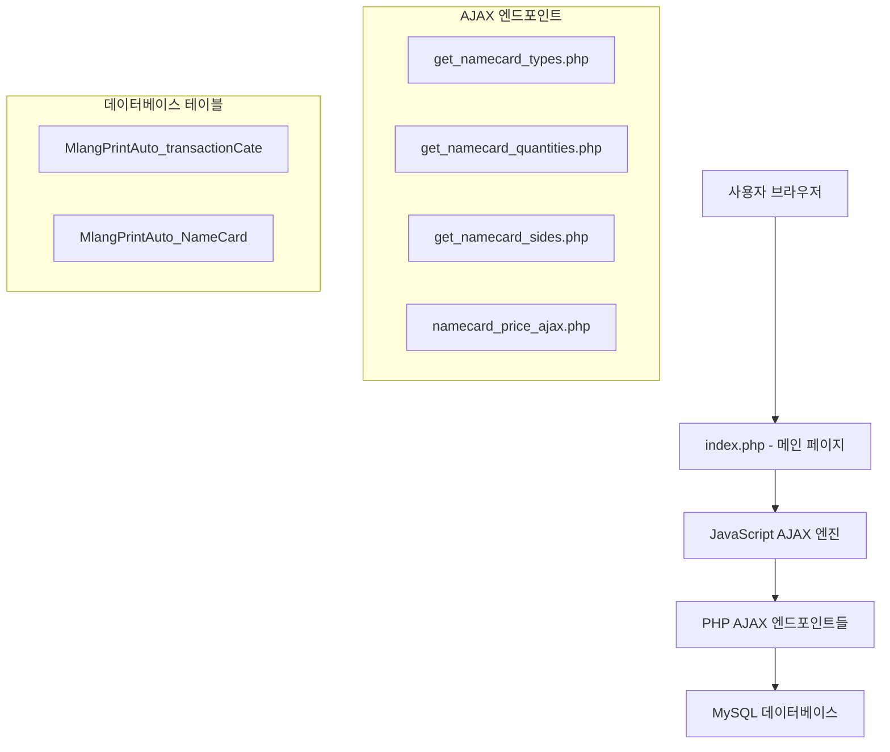
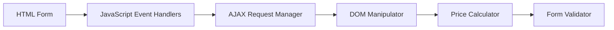
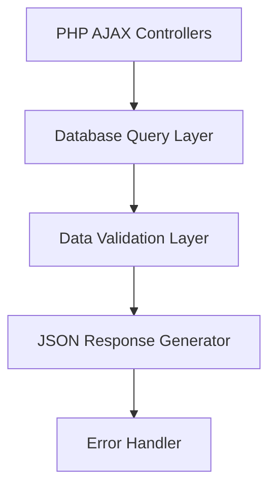
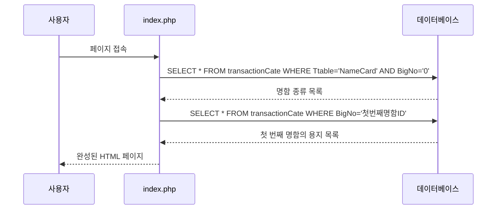
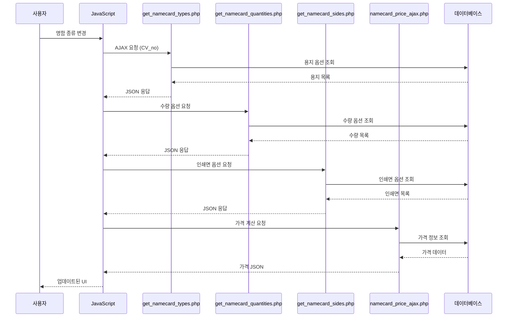

# 명함 자동견적 시스템 설계 문서

## 개요

명함 자동견적 시스템은 클라이언트-서버 아키텍처를 기반으로 한 웹 애플리케이션으로, AJAX를 활용한 비동기 통신과 연쇄적 옵션 업데이트를 통해 실시간 가격 계산 서비스를 제공합니다.

## 아키텍처

### 전체 시스템 아키텍처



### 클라이언트 사이드 아키텍처



### 서버 사이드 아키텍처



## 컴포넌트 및 인터페이스

### 1. 클라이언트 사이드 컴포넌트

#### 1.1 메인 폼 컨트롤러 (namecardForm)
```javascript
// 역할: 전체 폼의 상태 관리 및 이벤트 조정
interface NameCardFormController {
    elements: {
        NC_type: HTMLSelectElement,      // 명함 종류
        NC_paper: HTMLSelectElement,     // 용지 종류  
        NC_amount: HTMLSelectElement,    // 수량
        NC_sides: HTMLSelectElement,     // 인쇄면
        ordertype: HTMLSelectElement     // 주문 방법
    },
    priceFields: {
        NC_Price: HTMLInputElement,      // 인쇄비
        NC_DS_Price: HTMLInputElement,   // 편집비
        NC_Order_Price: HTMLInputElement // 총액
    }
}
```

#### 1.2 AJAX 통신 매니저
```javascript
interface AjaxManager {
    createXHR(): XMLHttpRequest,
    sendRequest(url: string, callback: Function): void,
    handleResponse(response: string): Object,
    handleError(error: Error): void
}
```

#### 1.3 옵션 업데이트 체인
```javascript
interface OptionUpdateChain {
    change_NameCard_Field(val: string): void,      // 1단계: 용지 옵션 업데이트
    updateNameCardQuantities(type: string): void,  // 2단계: 수량 옵션 업데이트  
    updateNameCardSides(): void,                   // 3단계: 인쇄면 옵션 업데이트
    nc_calc_ok(): void                            // 4단계: 가격 계산
}
```

### 2. 서버 사이드 컴포넌트

#### 2.1 AJAX 엔드포인트 컨트롤러들
```php
interface NameCardTypesController {
    // get_namecard_types.php
    public function getTypes(string $CV_no): array;
}

interface NameCardQuantitiesController {
    // get_namecard_quantities.php  
    public function getQuantities(string $NC_type, string $NC_paper): array;
}

interface NameCardSidesController {
    // get_namecard_sides.php
    public function getSides(string $NC_type, string $NC_paper, string $NC_amount): array;
}

interface NameCardPriceController {
    // namecard_price_ajax.php
    public function calculatePrice(array $params): array;
}
```

#### 2.2 데이터베이스 액세스 레이어
```php
interface DatabaseAccessLayer {
    public function getTransactionCategories(string $table, string $bigNo): array;
    public function getNameCardOptions(array $criteria): array;
    public function getPriceInfo(array $criteria): array;
}
```

## 데이터 모델

### 1. 데이터베이스 스키마

#### MlangPrintAuto_transactionCate (카테고리 테이블)
```sql
CREATE TABLE MlangPrintAuto_transactionCate (
    no INT PRIMARY KEY,           -- 고유 ID
    title VARCHAR(255),           -- 표시될 이름
    BigNo INT,                   -- 상위 카테고리 ID (0=최상위)
    Ttable VARCHAR(50),          -- 시스템 구분 (NameCard, LittlePrint 등)
    INDEX idx_big_table (BigNo, Ttable)
);
```

#### MlangPrintAuto_NameCard (가격 테이블)
```sql
CREATE TABLE MlangPrintAuto_NameCard (
    id INT PRIMARY KEY AUTO_INCREMENT,
    style INT,                   -- 명함 종류 ID (transactionCate.no 참조)
    Section INT,                 -- 용지 종류 ID (transactionCate.no 참조)  
    quantity INT,                -- 수량 (500, 1000, 2000 등)
    POtype INT,                  -- 인쇄면 (1=단면, 2=양면)
    money DECIMAL(10,2),         -- 인쇄비
    DesignMoney DECIMAL(10,2),   -- 디자인비
    INDEX idx_combination (style, Section, quantity, POtype)
);
```

### 2. 데이터 흐름 모델

#### 초기 로드 데이터 흐름


#### 옵션 변경 시 데이터 흐름


## 에러 처리

### 1. 클라이언트 사이드 에러 처리

#### AJAX 에러 처리 전략
```javascript
function handleAjaxError(xhr, operation) {
    const errorStrategies = {
        404: () => console.error(`${operation} 엔드포인트를 찾을 수 없습니다`),
        500: () => console.error(`${operation} 서버 내부 오류가 발생했습니다`),
        timeout: () => console.error(`${operation} 요청 시간이 초과되었습니다`),
        default: () => console.error(`${operation} 알 수 없는 오류가 발생했습니다`)
    };
    
    const strategy = errorStrategies[xhr.status] || errorStrategies.default;
    strategy();
}
```

#### 데이터 검증 에러 처리
```javascript
function validateFormData() {
    const validationRules = {
        NC_type: { required: true, message: "명함 종류를 선택해주세요" },
        NC_paper: { required: true, message: "용지 종류를 선택해주세요" },
        NC_amount: { required: true, message: "수량을 선택해주세요" },
        NC_sides: { required: true, message: "인쇄면을 선택해주세요" }
    };
    
    // 검증 로직 구현
}
```

### 2. 서버 사이드 에러 처리

#### 표준 에러 응답 형식
```php
interface ErrorResponse {
    success: boolean,
    message: string,
    error_code?: string,
    debug_info?: array  // 개발 환경에서만
}
```

#### 데이터베이스 에러 처리
```php
function handleDatabaseError($error) {
    error_log("Database Error: " . $error->getMessage());
    
    return json_encode([
        'success' => false,
        'message' => '데이터를 불러오는 중 오류가 발생했습니다.',
        'error_code' => 'DB_ERROR'
    ]);
}
```

## 테스팅 전략

### 1. 단위 테스트

#### JavaScript 함수 테스트
```javascript
// 테스트 대상 함수들
describe('NameCard AJAX Functions', () => {
    test('change_NameCard_Field should clear existing options', () => {
        // 테스트 구현
    });
    
    test('nc_calc_ok should calculate price correctly', () => {
        // 테스트 구현  
    });
});
```

#### PHP 엔드포인트 테스트
```php
class NameCardEndpointTest extends PHPUnit\Framework\TestCase {
    public function testGetNameCardTypes() {
        // get_namecard_types.php 테스트
    }
    
    public function testCalculatePrice() {
        // namecard_price_ajax.php 테스트
    }
}
```

### 2. 통합 테스트

#### AJAX 통신 테스트
```javascript
describe('AJAX Integration Tests', () => {
    test('should complete full option update chain', async () => {
        // 명함 종류 변경 → 용지 → 수량 → 인쇄면 → 가격 계산
        // 전체 체인 테스트
    });
});
```

### 3. 사용자 시나리오 테스트

#### E2E 테스트 시나리오
```javascript
describe('User Journey Tests', () => {
    test('사용자가 명함을 주문하는 전체 과정', () => {
        // 1. 페이지 로드
        // 2. 명함 종류 선택
        // 3. 옵션들 자동 업데이트 확인
        // 4. 가격 계산 확인
        // 5. 주문 버튼 클릭
        // 6. 검증 및 제출 확인
    });
});
```

## 성능 최적화

### 1. 클라이언트 사이드 최적화

#### AJAX 요청 최적화
```javascript
// 디바운싱을 통한 불필요한 요청 방지
function debounce(func, wait) {
    let timeout;
    return function executedFunction(...args) {
        const later = () => {
            clearTimeout(timeout);
            func(...args);
        };
        clearTimeout(timeout);
        timeout = setTimeout(later, wait);
    };
}

const debouncedPriceCalculation = debounce(nc_calc_ok, 300);
```

#### DOM 조작 최적화
```javascript
// 배치 DOM 업데이트
function updateOptionsInBatch(selectElement, options) {
    const fragment = document.createDocumentFragment();
    options.forEach(option => {
        const optionElement = new Option(option.title, option.no);
        fragment.appendChild(optionElement);
    });
    
    selectElement.innerHTML = '';
    selectElement.appendChild(fragment);
}
```

### 2. 서버 사이드 최적화

#### 데이터베이스 쿼리 최적화
```sql
-- 인덱스 최적화
CREATE INDEX idx_namecard_lookup ON MlangPrintAuto_NameCard (style, Section, quantity, POtype);
CREATE INDEX idx_category_hierarchy ON MlangPrintAuto_transactionCate (BigNo, Ttable);

-- 쿼리 최적화 예시
SELECT nc.*, tc1.title as style_name, tc2.title as section_name
FROM MlangPrintAuto_NameCard nc
JOIN MlangPrintAuto_transactionCate tc1 ON nc.style = tc1.no
JOIN MlangPrintAuto_transactionCate tc2 ON nc.Section = tc2.no
WHERE nc.style = ? AND nc.Section = ? AND nc.quantity = ? AND nc.POtype = ?;
```

#### 캐싱 전략
```php
// 옵션 데이터 캐싱
class NameCardCache {
    private static $cache = [];
    
    public static function getOptions($key, $callback) {
        if (!isset(self::$cache[$key])) {
            self::$cache[$key] = $callback();
        }
        return self::$cache[$key];
    }
}
```

## 데이터베이스 연결 아키텍처

### 1. 데이터베이스 연결 파일 구조

#### 연결 파일 종류 및 용도
```
프로젝트 루트/
├── db.php              # 메인 페이지용 (고정 서버 환경)
├── db_auto.php         # 환경 자동 감지 (개발/운영 자동 전환)
└── MlangPrintAuto/
    └── NameCard/
        └── db_ajax.php  # AJAX 전용 (깨끗한 JSON 응답)
```

#### 각 파일의 특징 및 사용 시나리오

**db.php (메인 페이지용)**
```php
<?php
// 특징: 고정된 서버 환경 설정, HTML 출력 없음
$host = "localhost";
$user = "duson1830";
$password = "du1830";
$dataname = "duson1830";

$db = mysqli_connect($host, $user, $password, $dataname);
mysqli_query($db, "SET NAMES 'utf8'");

// 사용 시나리오: index.php 등 메인 페이지
include "$HomeDir/db.php";
?>
```

**db_auto.php (환경 자동 감지)**
```php
<?php
// 특징: localhost/서버 환경 자동 감지, 디버깅 로그 출력
$is_localhost = (strpos($_SERVER['HTTP_HOST'], 'localhost') !== false);

if ($is_localhost) {
    // XAMPP 환경
    $user = "root";
    $password = "";
} else {
    // 서버 환경
    $user = "duson1830";
    $password = "du1830";
}

// ⚠️ 주의: JavaScript 콘솔 로그 출력으로 인한 JSON 파싱 오류 위험
echo "<script>console.log('데이터베이스 연결 성공');</script>";

// 사용 시나리오: 개발 환경에서 디버깅이 필요한 메인 페이지
?>
```

**db_ajax.php (AJAX 전용)**
```php
<?php
// 특징: 순수한 데이터베이스 연결만, 어떤 출력도 없음
$host = "localhost";
$user = "duson1830";
$password = "du1830";
$dataname = "duson1830";

$db = new mysqli($host, $user, $password, $dataname);
$db->set_charset("utf8");

// 사용 시나리오: 모든 AJAX 엔드포인트
include "../NameCard/db_ajax.php";
?>
```

### 2. AJAX 파일에서 JSON 파싱 오류의 원인과 해결

#### 문제의 근본 원인
```php
// db_auto.php의 이 출력이 JSON 파싱 오류를 발생시킴
echo "<script>console.log('데이터베이스 연결 성공');</script>";

// 서버 응답 예시:
// <script>console.log('데이터베이스 연결 성공');</script>{"success":true,"data":{...}}
//  ↑ 이 부분 때문에 JavaScript에서 JSON.parse() 실패
```

#### 오류 증상
```javascript
// 브라우저 콘솔에서 나타나는 오류
❌ 응답 파싱 오류: Unexpected token '<'
// '<script>' 태그의 '<' 문자를 JSON으로 파싱하려다 실패
```

#### 해결 방법
```php
// AJAX 파일에서 올바른 데이터베이스 연결 방법
<?php
// 1. 출력 버퍼링으로 불필요한 출력 차단
ob_start();

// 2. 에러 표시 끄기
ini_set('display_errors', 0);
error_reporting(0);

// 3. JSON 헤더 먼저 설정
header('Content-Type: application/json; charset=utf-8');

// 4. 깨끗한 데이터베이스 연결 사용
include "../NameCard/db_ajax.php";

// 5. 불필요한 출력 제거
ob_clean();

// 6. 오직 JSON만 출력
echo json_encode($response);
?>
```

### 3. 데이터베이스 연결 사용 가이드라인

#### 파일 타입별 권장 연결 방식

| 파일 타입 | 권장 연결 파일 | 이유 |
|-----------|----------------|------|
| 메인 페이지 (index.php) | `db.php` 또는 `db_auto.php` | HTML 출력이 허용됨 |
| AJAX 엔드포인트 | `db_ajax.php` | 순수한 JSON 응답 필요 |
| 디버깅/테스트 파일 | `db_auto.php` | 환경 감지 및 로깅 유용 |

#### AJAX 파일 작성 시 체크리스트

```php
// ✅ 올바른 AJAX 파일 구조
<?php
// 1. 출력 버퍼링 시작
ob_start();

// 2. 에러 출력 비활성화
ini_set('display_errors', 0);
error_reporting(0);

// 3. JSON 헤더 설정
header('Content-Type: application/json; charset=utf-8');

// 4. 깨끗한 DB 연결
include "../NameCard/db_ajax.php";

// 5. 버퍼 정리
ob_clean();

// 6. 비즈니스 로직 처리
$result = processRequest();

// 7. JSON 응답만 출력
echo json_encode($result);
exit;
?>
```

#### 금지사항 (AJAX 파일에서)

```php
// ❌ 절대 하지 말아야 할 것들

// 1. HTML/JavaScript 출력
echo "<script>console.log('디버그');</script>";
echo "<div>디버그 정보</div>";

// 2. db_auto.php 직접 사용 (콘솔 로그 출력 때문)
include "../../db_auto.php";

// 3. 에러 메시지 직접 출력
die("에러 발생!");

// 4. 여러 번의 JSON 출력
echo json_encode($data1);
echo json_encode($data2);  // 두 번째 JSON은 파싱 오류 발생

// 5. JSON 전후 공백이나 다른 출력
echo " ";  // 공백도 JSON 파싱 오류 원인
echo json_encode($data);
echo "\n";  // 개행도 문제 발생 가능
```

### 4. 트러블슈팅 가이드

#### JSON 파싱 오류 진단 방법

1. **브라우저 네트워크 탭에서 실제 응답 확인**
```
개발자 도구 → Network 탭 → AJAX 요청 클릭 → Response 탭
실제 서버 응답에서 JSON 앞에 다른 내용이 있는지 확인
```

2. **콘솔에서 원본 응답 확인**
```javascript
// AJAX 요청에서 원본 응답 로깅
console.log("원본 서버 응답:", xhr.responseText);
```

3. **서버 사이드 디버깅**
```php
// 임시로 응답 내용을 파일에 저장하여 확인
file_put_contents('debug_response.txt', ob_get_contents());
```

#### 일반적인 해결 순서

1. **AJAX 파일에서 `db_auto.php` → `db_ajax.php`로 변경**
2. **출력 버퍼링 추가**
3. **에러 출력 비활성화**
4. **JSON 헤더 설정**
5. **불필요한 출력 제거**

### 5. 다른 시스템 적용 시 주의사항

#### 새로운 AJAX 시스템 구축 시 템플릿

```php
<?php
/**
 * [시스템명] AJAX 엔드포인트 템플릿
 * 예: 카다록, 소량인쇄, 상품권 등
 */

// 표준 AJAX 파일 헤더
ob_start();
ini_set('display_errors', 0);
error_reporting(0);
header('Content-Type: application/json; charset=utf-8');

// 데이터베이스 연결 (항상 db_ajax.php 사용)
include "../NameCard/db_ajax.php";
ob_clean();

try {
    // 입력 파라미터 검증
    $param1 = $_GET['param1'] ?? '';
    $param2 = $_GET['param2'] ?? '';
    
    if (empty($param1) || empty($param2)) {
        throw new Exception('필수 파라미터가 누락되었습니다.');
    }
    
    // 비즈니스 로직 처리
    $result = processBusinessLogic($param1, $param2);
    
    // 성공 응답
    echo json_encode([
        'success' => true,
        'data' => $result
    ]);
    
} catch (Exception $e) {
    // 에러 응답
    echo json_encode([
        'success' => false,
        'message' => $e->getMessage()
    ]);
}

exit;
?>
```

이 데이터베이스 연결 아키텍처 가이드는 향후 다른 시스템 개발 시 동일한 JSON 파싱 오류를 방지하고, 안정적인 AJAX 통신을 보장하기 위한 핵심 지침을 제공합니다.

## 보안 고려사항

### 1. 입력 검증 및 SQL 인젝션 방지
```php
// Prepared Statement 사용
function getNameCardPrice($style, $section, $quantity, $potype) {
    global $db;
    $stmt = $db->prepare("SELECT * FROM MlangPrintAuto_NameCard WHERE style=? AND Section=? AND quantity=? AND POtype=?");
    $stmt->bind_param("iiis", $style, $section, $quantity, $potype);
    $stmt->execute();
    return $stmt->get_result();
}
```

### 2. XSS 방지
```php
// 출력 시 HTML 이스케이프
function safeOutput($data) {
    return htmlspecialchars($data, ENT_QUOTES, 'UTF-8');
}
```

### 3. CSRF 방지
```php
// CSRF 토큰 검증
function validateCSRFToken($token) {
    return hash_equals($_SESSION['csrf_token'], $token);
}
```

이 설계 문서는 명함 자동견적 시스템의 전체적인 구조와 구현 방향을 제시하며, 실제 구현 시 참고할 수 있는 상세한 기술적 가이드라인을 포함하고 있습니다.