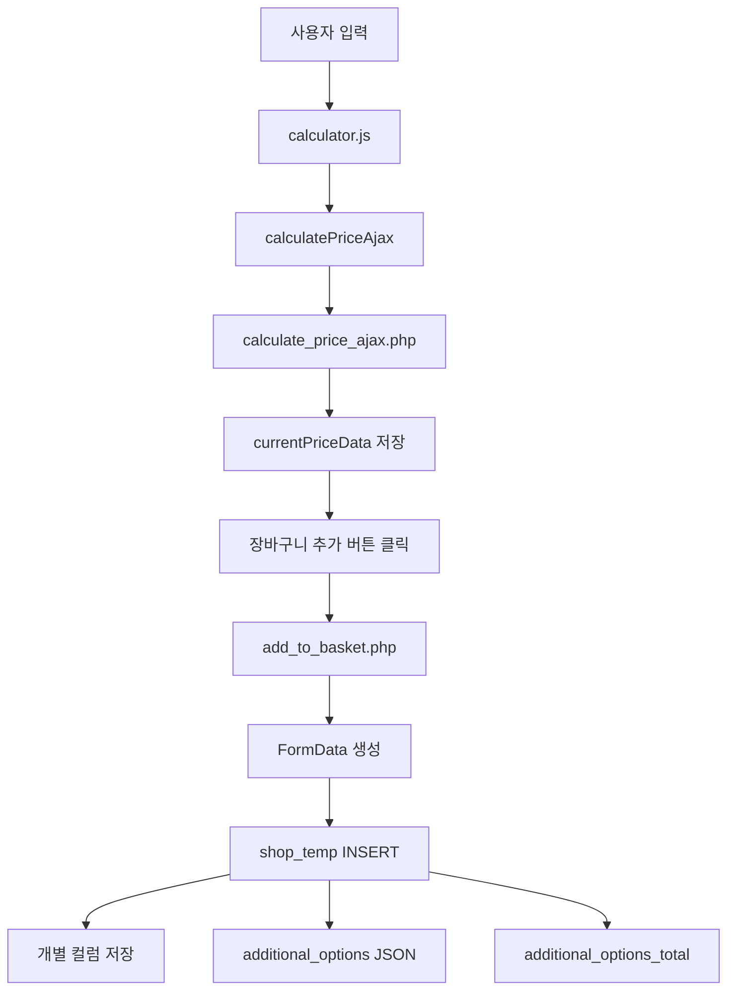
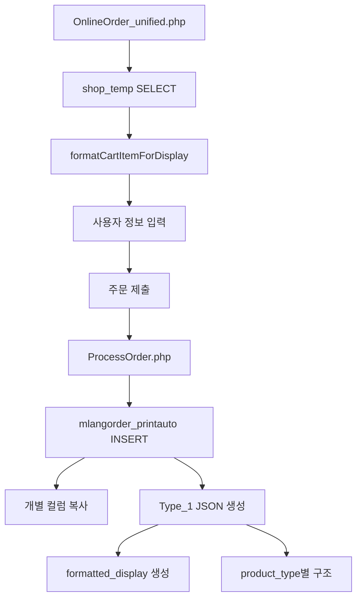
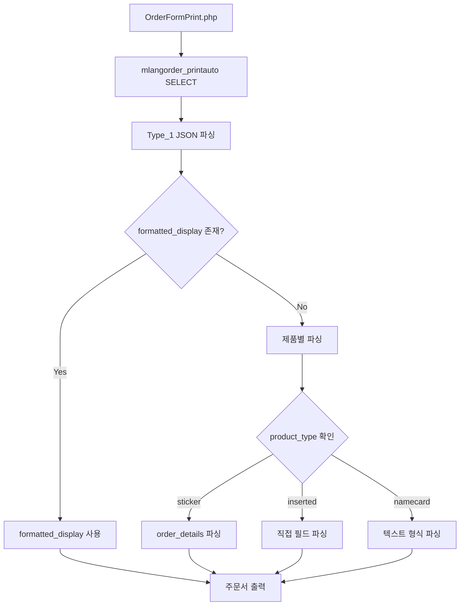

# 📊 추가 옵션 저장 시스템 분석 (Additional Options Storage System Analysis)

**작성일**: 2025-10-09
**목적**: shop_temp와 mlangorder_printauto 테이블 간 옵션 데이터 저장 구조 및 매핑 관계 분석

---

## 📋 목차

1. [개요 (Overview)](#개요-overview)
2. [테이블 구조 비교](#테이블-구조-비교)
3. [데이터 흐름 (Data Flow)](#데이터-흐름-data-flow)
4. [제품별 저장 패턴](#제품별-저장-패턴)
5. [Type_1 필드 구조 분석](#type_1-필드-구조-분석)
6. [명칭 규칙 (Naming Conventions)](#명칭-규칙-naming-conventions)
7. [구현 예제](#구현-예제)
8. [권장사항 및 주의사항](#권장사항-및-주의사항)

---

## 개요 (Overview)

### 시스템 아키텍처

```
사용자 UI (Product Calculator)
        ↓
  JavaScript (calculator.js)
        ↓ AJAX
  calculate_price_ajax.php
        ↓ JSON Response
  calculator.js → currentPriceData
        ↓
  add_to_basket.php
        ↓ INSERT with prepared statement
╔═════════════════════════════════╗
║      shop_temp (장바구니)        ║
║  - 세션 기반 임시 저장           ║
║  - 개별 컬럼 + JSON 이중 저장    ║
╚═════════════════════════════════╝
        ↓
  OnlineOrder_unified.php
        ↓ ProcessOrder logic
╔═════════════════════════════════╗
║  mlangorder_printauto (주문)    ║
║  - 영구 저장                     ║
║  - 개별 컬럼 + Type_1 JSON       ║
╚═════════════════════════════════╝
        ↓
  OrderFormPrint.php
        ↓ Display
  주문서 인쇄 (Print View)
```

### 핵심 원칙

1. **이중 저장 전략**: 개별 컬럼 (검색/집계) + JSON (완전한 정보)
2. **Type_1 필드**: 제품별로 다른 JSON 구조 사용
3. **formatted_display**: UI 표시용 사전 포맷팅 문자열
4. **product_type**: 제품 식별자 (inserted, sticker, envelope 등)

---

## 테이블 구조 비교

### shop_temp (장바구니 테이블)

#### 기본 컬럼
| 컬럼명 | 타입 | 설명 |
|--------|------|------|
| `no` | INT (PK) | 장바구니 항목 ID |
| `session_id` | VARCHAR(255) | PHP 세션 ID |
| `product_type` | VARCHAR(50) | 제품 타입 (inserted, sticker 등) |
| `MY_type` | VARCHAR(50) | 색상/인쇄 타입 |
| `MY_Fsd` | VARCHAR(50) | 용지 종류 |
| `PN_type` | VARCHAR(50) | 규격/크기 |
| `MY_amount` | VARCHAR(50) | 수량 |
| `POtype` | VARCHAR(10) | 인쇄면 (1=단면, 4=양면) |
| `ordertype` | VARCHAR(50) | 주문 타입 (print/design) |
| `st_price` | INT | 부가세 제외 가격 |
| `st_price_vat` | INT | 부가세 포함 가격 |

#### 추가 옵션 컬럼 (전단지/카다록/포스터용)
| 컬럼명 | 타입 | 기본값 | 설명 |
|--------|------|--------|------|
| `coating_enabled` | TINYINT(1) | 0 | 코팅 사용 여부 |
| `coating_type` | VARCHAR(20) | NULL | 코팅 종류 (single, double, single_matte, double_matte) |
| `coating_price` | INT | 0 | 코팅 가격 |
| `folding_enabled` | TINYINT(1) | 0 | 접지 사용 여부 |
| `folding_type` | VARCHAR(20) | NULL | 접지 종류 (2fold, 3fold, accordion, gate) |
| `folding_price` | INT | 0 | 접지 가격 |
| `creasing_enabled` | TINYINT(1) | 0 | 오시 사용 여부 |
| `creasing_lines` | INT | 0 | 오시 줄 수 (1~3) |
| `creasing_price` | INT | 0 | 오시 가격 |
| `additional_options` | TEXT | NULL | JSON 형식 옵션 전체 |
| `additional_options_total` | INT | 0 | 추가 옵션 총액 |

#### 파일 업로드 컬럼
| 컬럼명 | 타입 | 설명 |
|--------|------|------|
| `work_memo` | TEXT | 작업 메모 |
| `upload_method` | VARCHAR(20) | 업로드 방법 (upload/later) |
| `uploaded_files_info` | TEXT | 업로드 파일 정보 (JSON) |
| `upload_folder` | VARCHAR(255) | 업로드 폴더 경로 |

---

### mlangorder_printauto (주문 테이블)

#### 기본 컬럼
| 컬럼명 | 타입 | 설명 |
|--------|------|------|
| `no` | INT (PK) | 주문 번호 |
| `Name` | VARCHAR(100) | 주문자 이름 |
| `email` | VARCHAR(255) | 이메일 |
| `Tel` | VARCHAR(20) | 전화번호 |
| `Address` | TEXT | 주소 |
| `Type_1` | TEXT | **제품별 JSON 데이터 저장** |
| `Price` | INT | 부가세 제외 가격 |
| `Total_Price` | INT | 부가세 포함 가격 |
| `OrderState` | VARCHAR(20) | 주문 상태 |
| `created_at` | TIMESTAMP | 주문 생성 시간 |

#### 추가 옵션 컬럼 (shop_temp와 동일)
| 컬럼명 | 타입 | 기본값 | 설명 |
|--------|------|--------|------|
| `coating_enabled` | TINYINT(1) | 0 | 코팅 사용 여부 |
| `coating_type` | VARCHAR(20) | NULL | 코팅 종류 |
| `coating_price` | INT | 0 | 코팅 가격 |
| `folding_enabled` | TINYINT(1) | 0 | 접지 사용 여부 |
| `folding_type` | VARCHAR(20) | NULL | 접지 종류 |
| `folding_price` | INT | 0 | 접지 가격 |
| `creasing_enabled` | TINYINT(1) | 0 | 오시 사용 여부 |
| `creasing_lines` | INT | 0 | 오시 줄 수 |
| `creasing_price` | INT | 0 | 오시 가격 |

---

## 데이터 흐름 (Data Flow)

### 1단계: 장바구니 추가 (Add to Cart)



**add_to_basket.php 핵심 로직**:
```php
// 1. POST 데이터 수신
$price = intval($_POST['calculated_price'] ?? $_POST['price'] ?? 0);
$vat_price = intval($_POST['calculated_vat_price'] ?? $_POST['vat_price'] ?? 0);

// 2. 추가 옵션 JSON 생성
$additional_options = [
    'coating_enabled' => intval($_POST['coating_enabled'] ?? 0),
    'coating_type' => $_POST['coating_type'] ?? '',
    'coating_price' => intval($_POST['coating_price'] ?? 0),
    'folding_enabled' => intval($_POST['folding_enabled'] ?? 0),
    'folding_type' => $_POST['folding_type'] ?? '',
    'folding_price' => intval($_POST['folding_price'] ?? 0),
    'creasing_enabled' => intval($_POST['creasing_enabled'] ?? 0),
    'creasing_lines' => intval($_POST['creasing_lines'] ?? 0),
    'creasing_price' => intval($_POST['creasing_price'] ?? 0)
];
$additional_options_json = json_encode($additional_options, JSON_UNESCAPED_UNICODE);

// 3. INSERT with prepared statement
$insert_query = "INSERT INTO shop_temp
    (session_id, product_type, MY_type, PN_type, MY_Fsd, MY_amount, POtype, ordertype,
     st_price, st_price_vat, work_memo, upload_method, uploaded_files_info, upload_folder,
     coating_enabled, coating_type, coating_price,
     folding_enabled, folding_type, folding_price,
     creasing_enabled, creasing_lines, creasing_price,
     additional_options, additional_options_total)
    VALUES (?, ?, ?, ?, ?, ?, ?, ?, ?, ?, ?, ?, ?, ?, ?, ?, ?, ?, ?, ?, ?, ?, ?, ?, ?)";
```

---

### 2단계: 주문 처리 (Order Processing)



**ProcessOrder.php 핵심 로직** (OnlineOrder_unified.php 내부):
```php
foreach ($cart_items as $item) {
    // 1. shop_temp에서 데이터 읽기
    $base_price = intval($item['st_price']);
    $price_with_vat = intval($item['st_price_vat']);
    $product_type = $item['product_type'];

    // 2. 추가 옵션 데이터 복사
    $coating_enabled = intval($item['coating_enabled'] ?? 0);
    $coating_type = $item['coating_type'] ?? '';
    $coating_price = intval($item['coating_price'] ?? 0);
    // ... (folding, creasing도 동일)

    // 3. Type_1 JSON 생성 (제품별 구조)
    $type1_data = [
        'product_type' => $product_type,
        'MY_type' => $item['MY_type'],
        'MY_Fsd' => $item['MY_Fsd'],
        'PN_type' => $item['PN_type'],
        'POtype' => $item['POtype'],
        'MY_amount' => $item['MY_amount'],
        'ordertype' => $item['ordertype'],
        'formatted_display' => $formatted_display, // 사전 포맷팅
        'created_at' => date('Y-m-d H:i:s')
    ];
    $type1_json = json_encode($type1_data, JSON_UNESCAPED_UNICODE);

    // 4. mlangorder_printauto INSERT
    $insert_query = "INSERT INTO mlangorder_printauto
        (Name, email, Tel, Address, Type_1, Price, Total_Price, OrderState,
         coating_enabled, coating_type, coating_price,
         folding_enabled, folding_type, folding_price,
         creasing_enabled, creasing_lines, creasing_price)
        VALUES (?, ?, ?, ?, ?, ?, ?, ?, ?, ?, ?, ?, ?, ?, ?, ?, ?)";
}
```

---

### 3단계: 주문서 출력 (Order Print)



**OrderFormPrint.php 핵심 로직**:
```php
// 1. Type_1 JSON 파싱
$json_data = json_decode($order['Type_1'] ?? '', true);

// 2. formatted_display 우선 사용
if (!empty($json_data['formatted_display'])) {
    $formatted_lines = explode('\n', $json_data['formatted_display']);
    foreach ($formatted_lines as $line) {
        $details[] = $line; // "인쇄색상: 칼라인쇄(CMYK)"
    }
}

// 3. 제품별 fallback 처리
switch ($json_data['product_type']) {
    case 'sticker':
        // order_details 중첩 구조
        $sticker_data = $json_data['order_details'] ?? $json_data;
        if (!empty($sticker_data['jong'])) {
            $details[] = "재질: " . $sticker_data['jong'];
        }
        break;

    case 'inserted':
    case 'leaflet':
        // 직접 필드 접근
        if (!empty($json_data['MY_type'])) {
            $details[] = "색상: " . getCategoryName($json_data['MY_type']);
        }
        break;
}

// 4. 수량 추출
$order_data = $json_data['order_details'] ?? $json_data;
$quantity = $order_data['mesu'] ?? $order_data['MY_amount'] ?? 0;
```

---

## 제품별 저장 패턴

### 실제 데이터 샘플 (mlangorder_printauto.Type_1)

#### 1. 전단지 (inserted/leaflet)

```json
{
  "product_type": "inserted",
  "MY_type": "802",
  "MY_Fsd": "626",
  "PN_type": "821",
  "POtype": "1",
  "MY_amount": "0.5",
  "ordertype": "print",
  "formatted_display": "인쇄색상: 칼라인쇄(CMYK)\\n용지: 100g아트지(90g~95g A/T(합판인쇄)\\n규격: A4 (210x297)\\n인쇄면: 단면\\n수량: 1매\\n디자인: 인쇄만",
  "created_at": "2025-10-09 19:19:41"
}
```

**특징**:
- `formatted_display`: UI 표시용 사전 포맷팅
- 직접 필드 접근 가능
- `MY_amount`: 연/박스 단위 (0.5 = 500매)

#### 2. 스티커 (sticker)

```json
{
  "product_type": "sticker",
  "order_details": {
    "jong": "jil 아트유광코팅",
    "garo": 88,
    "sero": 15,
    "mesu": 1000,
    "domusong": "8000",
    "uhyung": 0
  },
  "formatted_display": "재질: jil 아트유광코팅\\n크기: 88mm × 15mm\\n수량: 1,000매\\n모양: 8000\\n편집비: 0원",
  "created_at": "2025-10-09 19:12:17"
}
```

**특징**:
- `order_details`: 중첩 객체 구조
- `mesu`: 매수 (1000 = 1000매)
- `garo`/`sero`: 가로/세로 크기 (mm)
- `domusong`: 모양 코드

#### 3. 명함 (namecard)

```
명함종류: 일반명함(쿠폰)
명함재질:
인쇄면: 단면
수량: 500매
편집디자인: 인쇄만
```

**특징**:
- **JSON이 아닌 텍스트 형식**
- 줄바꿈(`\n`)으로 구분
- 레거시 시스템 호환

#### 4. 봉투 (envelope)

```json
{
  "product_type": "envelope",
  "MY_type": "282",
  "PN_type": "",
  "MY_amount": "1000",
  "ordertype": "print",
  "formatted_display": "봉투종류: 중봉투\\n규격: [규격정보]\\n수량: 1,000매\\n디자인: 인쇄만",
  "created_at": "2025-10-09"
}
```

**특징**:
- 전단지와 유사한 직접 필드 구조
- `PN_type` 비어있을 수 있음

---

## Type_1 필드 구조 분석

### 구조 패턴 요약

| 제품 타입 | JSON 여부 | 중첩 구조 | formatted_display | 수량 필드 |
|-----------|----------|-----------|-------------------|----------|
| inserted | ✅ | ❌ | ✅ | MY_amount |
| leaflet | ✅ | ❌ | ✅ | MY_amount |
| sticker | ✅ | ✅ (order_details) | ✅ | order_details.mesu |
| namecard | ❌ (텍스트) | ❌ | ❌ | 텍스트 파싱 |
| envelope | ✅ | ❌ | ✅ | MY_amount |
| cadarok | ✅ | ❌ | ✅ | MY_amount |
| poster | ✅ | ❌ | ✅ | MY_amount |

### formatted_display 포맷

모든 JSON 기반 제품은 `formatted_display` 필드를 포함하며, 다음 형식을 따릅니다:

```
라벨1: 값1\n라벨2: 값2\n라벨3: 값3
```

**예시**:
```
인쇄색상: 칼라인쇄(CMYK)\n용지: 100g아트지\n규격: A4 (210x297)\n인쇄면: 단면\n수량: 1매
```

**파싱 방법**:
```php
$formatted_lines = explode('\n', $json_data['formatted_display']);
foreach ($formatted_lines as $line) {
    $line = trim($line);
    if (!empty($line) && strpos($line, ':') !== false) {
        list($label, $value) = explode(':', $line, 2);
        // $label = "인쇄색상", $value = " 칼라인쇄(CMYK)"
    }
}
```

---

## 명칭 규칙 (Naming Conventions)

### 데이터베이스 컬럼 명칭

#### 제품 기본 정보
| 컬럼명 | 한국어 | 설명 |
|--------|--------|------|
| `product_type` | 제품 타입 | inserted, sticker, envelope 등 |
| `MY_type` | 색상/인쇄 타입 | 칼라인쇄(CMYK), 흑백 등 |
| `MY_Fsd` | 용지 종류 | 100g아트지, 스노우지 등 |
| `PN_type` | 규격/크기 | A4, A5, 명함 등 |
| `POtype` | 인쇄면 | 1=단면, 4=양면 |
| `MY_amount` | 수량 | 매수 또는 연/박스 단위 |
| `ordertype` | 주문 타입 | print=인쇄만, design=디자인+인쇄 |

#### 추가 옵션 명칭
| 컬럼명 | 한국어 | 가능한 값 |
|--------|--------|----------|
| `coating_enabled` | 코팅 사용 여부 | 0 또는 1 |
| `coating_type` | 코팅 종류 | single, double, single_matte, double_matte |
| `coating_price` | 코팅 가격 | 정수 (원) |
| `folding_enabled` | 접지 사용 여부 | 0 또는 1 |
| `folding_type` | 접지 종류 | 2fold, 3fold, accordion, gate |
| `folding_price` | 접지 가격 | 정수 (원) |
| `creasing_enabled` | 오시 사용 여부 | 0 또는 1 |
| `creasing_lines` | 오시 줄 수 | 1, 2, 3 |
| `creasing_price` | 오시 가격 | 정수 (원) |
| `additional_options_total` | 추가 옵션 총액 | 정수 (원) |

### JavaScript 변수 명칭

```javascript
// 가격 데이터 저장
window.currentPriceData = {
    total_price: 32000,      // 부가세 제외
    vat_price: 35200         // 부가세 포함
};

// FormData 생성 시 반드시 이 이름 사용
formData.append("calculated_price", window.currentPriceData.total_price);
formData.append("calculated_vat_price", window.currentPriceData.vat_price);
formData.append("product_type", "inserted"); // 제품 타입 필수

// 추가 옵션
formData.append("coating_enabled", document.getElementById('coating_enabled').checked ? 1 : 0);
formData.append("coating_type", document.getElementById('coating_type').value);
formData.append("coating_price", document.getElementById('coating_price').value);
// ... (folding, creasing도 동일)
formData.append("additional_options_total", document.getElementById('additional_options_total').value);
```

### PHP 변수 명칭

```php
// POST 수신 시
$price = intval($_POST['calculated_price'] ?? $_POST['price'] ?? 0);
$vat_price = intval($_POST['calculated_vat_price'] ?? $_POST['vat_price'] ?? 0);
$product_type = $_POST['product_type'] ?? 'leaflet';

// shop_temp → mlangorder_printauto 전송 시
$base_price = intval($item['st_price']);
$price_with_vat = intval($item['st_price_vat']);

// 추가 옵션
$coating_enabled = intval($item['coating_enabled'] ?? 0);
$coating_type = $item['coating_type'] ?? '';
$coating_price = intval($item['coating_price'] ?? 0);
```

---

## 구현 예제

### 예제 1: 장바구니 추가 (Full Flow)

**1단계: HTML 폼**
```html
<!-- 기본 옵션 -->
<select name="MY_type" id="MY_type">...</select>
<select name="MY_Fsd" id="MY_Fsd">...</select>
<select name="PN_type" id="PN_type">...</select>
<input type="number" name="MY_amount" id="MY_amount" value="1000">

<!-- 추가 옵션 -->
<input type="checkbox" id="coating_enabled" class="option-toggle">
<select id="coating_type" name="coating_type">
    <option value="single">단면유광코팅</option>
    <option value="double">양면유광코팅</option>
</select>
<input type="hidden" id="coating_price" value="0">

<input type="checkbox" id="folding_enabled" class="option-toggle">
<select id="folding_type" name="folding_type">
    <option value="2fold">2단접지</option>
    <option value="3fold">3단접지</option>
</select>
<input type="hidden" id="folding_price" value="0">

<input type="hidden" id="additional_options_total" value="0">
```

**2단계: JavaScript 가격 계산**
```javascript
async function calculatePrice() {
    const formData = new FormData();
    formData.append('MY_type', document.getElementById('MY_type').value);
    formData.append('PN_type', document.getElementById('PN_type').value);
    formData.append('MY_Fsd', document.getElementById('MY_Fsd').value);
    formData.append('MY_amount', document.getElementById('MY_amount').value);
    formData.append('POtype', document.querySelector('input[name="POtype"]:checked').value);
    formData.append('ordertype', document.querySelector('input[name="ordertype"]:checked').value);
    formData.append('additional_options_total', document.getElementById('additional_options_total').value);

    const response = await fetch('calculate_price_ajax.php', {
        method: 'POST',
        body: formData
    });

    const data = await response.json();

    // 🔧 중요: 이 변수에 저장
    window.currentPriceData = {
        total_price: data.total_price || 0,
        vat_price: data.vat_price || 0
    };

    // UI 업데이트
    document.getElementById('totalPrice').textContent = window.currentPriceData.vat_price.toLocaleString();
}
```

**3단계: 장바구니 추가**
```javascript
async function addToCart() {
    // 가격 계산이 먼저 완료되어야 함
    if (!window.currentPriceData) {
        alert('가격 계산이 필요합니다.');
        return;
    }

    const formData = new FormData();

    // 🔧 중요: 반드시 이 파라미터 이름 사용
    formData.append('calculated_price', Math.round(window.currentPriceData.total_price));
    formData.append('calculated_vat_price', Math.round(window.currentPriceData.vat_price));
    formData.append('product_type', 'inserted'); // 제품별 변경

    // 기본 옵션
    formData.append('MY_type', document.getElementById('MY_type').value);
    formData.append('PN_type', document.getElementById('PN_type').value);
    formData.append('MY_Fsd', document.getElementById('MY_Fsd').value);
    formData.append('MY_amount', document.getElementById('MY_amount').value);
    formData.append('POtype', document.querySelector('input[name="POtype"]:checked').value);
    formData.append('ordertype', document.querySelector('input[name="ordertype"]:checked').value);

    // 추가 옵션
    formData.append('coating_enabled', document.getElementById('coating_enabled').checked ? 1 : 0);
    formData.append('coating_type', document.getElementById('coating_type').value || '');
    formData.append('coating_price', document.getElementById('coating_price').value || 0);

    formData.append('folding_enabled', document.getElementById('folding_enabled').checked ? 1 : 0);
    formData.append('folding_type', document.getElementById('folding_type').value || '');
    formData.append('folding_price', document.getElementById('folding_price').value || 0);

    formData.append('creasing_enabled', document.getElementById('creasing_enabled').checked ? 1 : 0);
    formData.append('creasing_lines', document.getElementById('creasing_lines').value || 0);
    formData.append('creasing_price', document.getElementById('creasing_price').value || 0);

    formData.append('additional_options_total', document.getElementById('additional_options_total').value || 0);

    const response = await fetch('add_to_basket.php', {
        method: 'POST',
        body: formData
    });

    const result = await response.json();
    if (result.success) {
        alert('장바구니에 추가되었습니다.');
        location.href = '/mlangprintauto/shop/cart.php';
    }
}
```

**4단계: add_to_basket.php**
```php
<?php
session_start();
$session_id = session_id();

include "../../db.php";
$connect = $db;
mysqli_set_charset($connect, "utf8mb4");

// 🔧 중요: 이 파라미터 이름으로 수신
$price = intval($_POST['calculated_price'] ?? $_POST['price'] ?? 0);
$vat_price = intval($_POST['calculated_vat_price'] ?? $_POST['vat_price'] ?? 0);
$product_type = $_POST['product_type'] ?? 'leaflet';

// 기본 옵션
$MY_type = $_POST['MY_type'] ?? '';
$PN_type = $_POST['PN_type'] ?? '';
$MY_Fsd = $_POST['MY_Fsd'] ?? '';
$MY_amount = $_POST['MY_amount'] ?? '';
$POtype = $_POST['POtype'] ?? '';
$ordertype = $_POST['ordertype'] ?? '';

// 추가 옵션 (개별 컬럼)
$coating_enabled = intval($_POST['coating_enabled'] ?? 0);
$coating_type = $_POST['coating_type'] ?? '';
$coating_price = intval($_POST['coating_price'] ?? 0);

$folding_enabled = intval($_POST['folding_enabled'] ?? 0);
$folding_type = $_POST['folding_type'] ?? '';
$folding_price = intval($_POST['folding_price'] ?? 0);

$creasing_enabled = intval($_POST['creasing_enabled'] ?? 0);
$creasing_lines = intval($_POST['creasing_lines'] ?? 0);
$creasing_price = intval($_POST['creasing_price'] ?? 0);

$additional_options_total = intval($_POST['additional_options_total'] ?? 0);

// 추가 옵션 (JSON)
$additional_options = [
    'coating_enabled' => $coating_enabled,
    'coating_type' => $coating_type,
    'coating_price' => $coating_price,
    'folding_enabled' => $folding_enabled,
    'folding_type' => $folding_type,
    'folding_price' => $folding_price,
    'creasing_enabled' => $creasing_enabled,
    'creasing_lines' => $creasing_lines,
    'creasing_price' => $creasing_price
];
$additional_options_json = json_encode($additional_options, JSON_UNESCAPED_UNICODE);

// INSERT
$insert_query = "INSERT INTO shop_temp
    (session_id, product_type, MY_type, PN_type, MY_Fsd, MY_amount, POtype, ordertype,
     st_price, st_price_vat,
     coating_enabled, coating_type, coating_price,
     folding_enabled, folding_type, folding_price,
     creasing_enabled, creasing_lines, creasing_price,
     additional_options, additional_options_total)
    VALUES (?, ?, ?, ?, ?, ?, ?, ?, ?, ?, ?, ?, ?, ?, ?, ?, ?, ?, ?, ?, ?)";

$stmt = mysqli_prepare($connect, $insert_query);
mysqli_stmt_bind_param($stmt, "ssssssssiiiiiiiiiisi",
    $session_id, $product_type, $MY_type, $PN_type, $MY_Fsd, $MY_amount, $POtype, $ordertype,
    $price, $vat_price,
    $coating_enabled, $coating_type, $coating_price,
    $folding_enabled, $folding_type, $folding_price,
    $creasing_enabled, $creasing_lines, $creasing_price,
    $additional_options_json, $additional_options_total);

if (mysqli_stmt_execute($stmt)) {
    echo json_encode([
        'success' => true,
        'message' => '장바구니에 추가되었습니다.',
        'cart_id' => mysqli_insert_id($connect),
        'additional_options_total' => $additional_options_total
    ]);
} else {
    echo json_encode([
        'success' => false,
        'message' => '오류: ' . mysqli_stmt_error($stmt)
    ]);
}

mysqli_stmt_close($stmt);
mysqli_close($connect);
?>
```

---

### 예제 2: 주문 처리 및 Type_1 생성

**OnlineOrder_unified.php 내부 ProcessOrder 로직**:

```php
// 1. shop_temp에서 장바구니 항목 조회
$cart_query = "SELECT * FROM shop_temp WHERE session_id = ?";
$stmt = mysqli_prepare($connect, $cart_query);
mysqli_stmt_bind_param($stmt, "s", $session_id);
mysqli_stmt_execute($stmt);
$cart_result = mysqli_stmt_get_result($stmt);

while ($item = mysqli_fetch_assoc($cart_result)) {
    // 2. 가격 정보
    $base_price = intval($item['st_price']);
    $price_with_vat = intval($item['st_price_vat']);
    $product_type = $item['product_type'];

    // 3. 추가 옵션 정보
    $coating_enabled = intval($item['coating_enabled'] ?? 0);
    $coating_type = $item['coating_type'] ?? '';
    $coating_price = intval($item['coating_price'] ?? 0);

    $folding_enabled = intval($item['folding_enabled'] ?? 0);
    $folding_type = $item['folding_type'] ?? '';
    $folding_price = intval($item['folding_price'] ?? 0);

    $creasing_enabled = intval($item['creasing_enabled'] ?? 0);
    $creasing_lines = intval($item['creasing_lines'] ?? 0);
    $creasing_price = intval($item['creasing_price'] ?? 0);

    // 4. formatted_display 생성
    $formatted_display = "";

    // 기본 정보
    if (!empty($item['MY_type'])) {
        $formatted_display .= "인쇄색상: " . getCategoryName($connect, $item['MY_type']) . "\\n";
    }
    if (!empty($item['MY_Fsd'])) {
        $formatted_display .= "용지: " . getCategoryName($connect, $item['MY_Fsd']) . "\\n";
    }
    if (!empty($item['PN_type'])) {
        $formatted_display .= "규격: " . getCategoryName($connect, $item['PN_type']) . "\\n";
    }
    $formatted_display .= "인쇄면: " . ($item['POtype'] == '1' ? '단면' : '양면') . "\\n";
    $formatted_display .= "수량: " . number_format($item['MY_amount']) . "매\\n";
    $formatted_display .= "디자인: " . ($item['ordertype'] == 'print' ? '인쇄만' : '디자인+인쇄');

    // 추가 옵션 표시
    if ($coating_enabled) {
        $formatted_display .= "\\n코팅: " . $coating_type . " (" . number_format($coating_price) . "원)";
    }
    if ($folding_enabled) {
        $formatted_display .= "\\n접지: " . $folding_type . " (" . number_format($folding_price) . "원)";
    }
    if ($creasing_enabled) {
        $formatted_display .= "\\n오시: " . $creasing_lines . "줄 (" . number_format($creasing_price) . "원)";
    }

    // 5. Type_1 JSON 생성
    $type1_data = [
        'product_type' => $product_type,
        'MY_type' => $item['MY_type'],
        'MY_Fsd' => $item['MY_Fsd'],
        'PN_type' => $item['PN_type'],
        'POtype' => $item['POtype'],
        'MY_amount' => $item['MY_amount'],
        'ordertype' => $item['ordertype'],
        'formatted_display' => $formatted_display,
        'created_at' => date('Y-m-d H:i:s')
    ];
    $type1_json = json_encode($type1_data, JSON_UNESCAPED_UNICODE);

    // 6. mlangorder_printauto INSERT
    $order_query = "INSERT INTO mlangorder_printauto
        (Name, email, Tel, Address, Type_1, Price, Total_Price, OrderState,
         coating_enabled, coating_type, coating_price,
         folding_enabled, folding_type, folding_price,
         creasing_enabled, creasing_lines, creasing_price)
        VALUES (?, ?, ?, ?, ?, ?, ?, ?, ?, ?, ?, ?, ?, ?, ?, ?, ?)";

    $order_stmt = mysqli_prepare($connect, $order_query);
    mysqli_stmt_bind_param($order_stmt, "sssssiisisiisiii",
        $name, $email, $tel, $address, $type1_json, $base_price, $price_with_vat, $order_state,
        $coating_enabled, $coating_type, $coating_price,
        $folding_enabled, $folding_type, $folding_price,
        $creasing_enabled, $creasing_lines, $creasing_price);

    mysqli_stmt_execute($order_stmt);
    $order_no = mysqli_insert_id($connect);

    mysqli_stmt_close($order_stmt);
}
```

---

### 예제 3: 주문서 출력 (OrderFormPrint.php)

```php
<?php
// 1. 주문 정보 조회
$order_query = "SELECT * FROM mlangorder_printauto WHERE no = ? AND email = ?";
$stmt = mysqli_prepare($connect, $order_query);
mysqli_stmt_bind_param($stmt, "is", $order_no, $email);
mysqli_stmt_execute($stmt);
$result = mysqli_stmt_get_result($stmt);
$order = mysqli_fetch_assoc($result);

// 2. Type_1 JSON 파싱
$json_data = json_decode($order['Type_1'] ?? '', true);
$details = [];

// 3. formatted_display 우선 사용
if (!empty($json_data['formatted_display'])) {
    $formatted_lines = explode('\\n', $json_data['formatted_display']);
    foreach ($formatted_lines as $line) {
        $line = trim($line);
        if (!empty($line)) {
            $details[] = $line;
        }
    }
} else {
    // 4. 제품별 fallback 파싱
    $product_type = $json_data['product_type'] ?? '';

    switch ($product_type) {
        case 'sticker':
            $details[] = "🏷️ 스티커";
            $sticker_data = $json_data['order_details'] ?? $json_data;

            if (!empty($sticker_data['jong'])) {
                $details[] = "재질: " . $sticker_data['jong'];
            }
            if (!empty($sticker_data['garo']) && !empty($sticker_data['sero'])) {
                $details[] = "크기: " . $sticker_data['garo'] . "×" . $sticker_data['sero'] . "mm";
            }
            if (!empty($sticker_data['domusong'])) {
                $details[] = "모양: " . $sticker_data['domusong'];
            }
            break;

        case 'inserted':
        case 'leaflet':
            $details[] = "📄 전단지";
            if (!empty($json_data['MY_type'])) {
                $details[] = "색상: " . getCategoryName($connect, $json_data['MY_type']);
            }
            if (!empty($json_data['MY_Fsd'])) {
                $details[] = "용지: " . getCategoryName($connect, $json_data['MY_Fsd']);
            }
            if (!empty($json_data['PN_type'])) {
                $details[] = "규격: " . getCategoryName($connect, $json_data['PN_type']);
            }
            $details[] = "인쇄면: " . ($json_data['POtype'] == '1' ? '단면' : '양면');
            break;

        case 'namecard':
            // 텍스트 형식 파싱
            $lines = explode("\n", $order['Type_1']);
            foreach ($lines as $line) {
                $details[] = trim($line);
            }
            break;
    }
}

// 5. 수량 추출
$order_data = $json_data['order_details'] ?? $json_data;
$quantity = $order_data['mesu'] ?? $order_data['MY_amount'] ?? 0;
if ($quantity > 0) {
    $quantity_display = number_format($quantity) . '매';
} else {
    $quantity_display = '수량 정보 없음';
}

// 6. 추가 옵션 표시
$additional_options_html = "";
if (intval($order['coating_enabled']) == 1) {
    $additional_options_html .= "<div>코팅: " . $order['coating_type'] . " (" . number_format($order['coating_price']) . "원)</div>";
}
if (intval($order['folding_enabled']) == 1) {
    $additional_options_html .= "<div>접지: " . $order['folding_type'] . " (" . number_format($order['folding_price']) . "원)</div>";
}
if (intval($order['creasing_enabled']) == 1) {
    $additional_options_html .= "<div>오시: " . $order['creasing_lines'] . "줄 (" . number_format($order['creasing_price']) . "원)</div>";
}

// 7. HTML 출력
?>
<table>
    <tr>
        <td>주문번호</td>
        <td>#<?php echo $order['no']; ?></td>
    </tr>
    <tr>
        <td>상세정보</td>
        <td>
            <?php foreach ($details as $detail): ?>
                <div><?php echo htmlspecialchars($detail); ?></div>
            <?php endforeach; ?>
            <?php echo $additional_options_html; ?>
        </td>
    </tr>
    <tr>
        <td>수량</td>
        <td><?php echo $quantity_display; ?></td>
    </tr>
    <tr>
        <td>금액</td>
        <td>₩<?php echo number_format($order['Total_Price']); ?></td>
    </tr>
</table>
```

---

## 권장사항 및 주의사항

### ✅ 권장사항 (Best Practices)

#### 1. 이중 저장 전략 유지
```php
// ✅ Good: 개별 컬럼 + JSON 모두 저장
INSERT INTO shop_temp (
    coating_enabled, coating_type, coating_price,  // 개별 컬럼 (검색/집계)
    additional_options                             // JSON (완전한 정보)
)
```

**이유**:
- 개별 컬럼: SQL 검색 및 집계 쿼리 가능 (`WHERE coating_enabled = 1`)
- JSON: 스키마 변경 없이 새 옵션 추가 가능

#### 2. formatted_display 우선 사용
```php
// ✅ Good: formatted_display가 있으면 우선 사용
if (!empty($json_data['formatted_display'])) {
    return $json_data['formatted_display'];
}
// Fallback: 직접 파싱
```

**이유**:
- UI 표시용으로 이미 포맷팅되어 있음
- 일관된 표시 형식
- 파싱 오류 방지

#### 3. 제품별 파싱 로직 분리
```php
// ✅ Good: switch-case로 제품별 처리
switch ($product_type) {
    case 'sticker':
        // order_details 중첩 구조 처리
        break;
    case 'inserted':
        // 직접 필드 접근
        break;
}
```

**이유**:
- 제품마다 다른 JSON 구조
- 유지보수 용이
- 확장성

#### 4. 파라미터 이름 일관성
```javascript
// ✅ Good: 일관된 파라미터 이름 사용
formData.append("calculated_price", price);       // JavaScript
$price = $_POST['calculated_price'];              // PHP
```

**이유**:
- 가격 데이터 누락 방지
- 디버깅 용이
- 코드 가독성

#### 5. JSON 인코딩 시 JSON_UNESCAPED_UNICODE 사용
```php
// ✅ Good: 한글 깨짐 방지
$json = json_encode($data, JSON_UNESCAPED_UNICODE);
```

**이유**:
- 한글 문자 깨짐 방지
- DB 저장 시 가독성
- 로그 확인 용이

---

### ⚠️ 주의사항 (Common Pitfalls)

#### 1. ❌ 가격 파라미터 이름 오류
```javascript
// ❌ Wrong
formData.append("price", 32000);           // 0원으로 저장됨
formData.append("total", 35200);

// ✅ Correct
formData.append("calculated_price", 32000);      // st_price
formData.append("calculated_vat_price", 35200);  // st_price_vat
```

#### 2. ❌ product_type 누락
```javascript
// ❌ Wrong: product_type 없음
formData.append("MY_type", "802");

// ✅ Correct
formData.append("product_type", "inserted");
formData.append("MY_type", "802");
```

#### 3. ❌ order_details 중첩 구조 무시
```php
// ❌ Wrong: 스티커는 order_details가 없음
$jong = $json_data['jong'];  // NULL

// ✅ Correct
$sticker_data = $json_data['order_details'] ?? $json_data;
$jong = $sticker_data['jong'];
```

#### 4. ❌ formatted_display 파싱 시 이스케이프 무시
```php
// ❌ Wrong: \n이 실제 줄바꿈이 아닐 수 있음
$lines = explode("\n", $json_data['formatted_display']);

// ✅ Correct: 이중 백슬래시 처리
$lines = explode('\\n', $json_data['formatted_display']);
```

#### 5. ❌ 명함 제품을 JSON으로 가정
```php
// ❌ Wrong: 명함은 JSON이 아님
$json_data = json_decode($order['Type_1'], true);
$name = $json_data['name'];  // ERROR

// ✅ Correct: 명함은 텍스트 파싱
if (strpos($order['Type_1'], '{') === 0) {
    $json_data = json_decode($order['Type_1'], true);
} else {
    // 텍스트 형식 파싱
    $lines = explode("\n", $order['Type_1']);
}
```

#### 6. ❌ 추가 옵션 총액 계산 안함
```javascript
// ❌ Wrong: 추가 옵션 가격 미반영
const totalPrice = basePrice;

// ✅ Correct
const totalPrice = basePrice + additionalOptionsTotal;
```

#### 7. ❌ Prepared Statement 타입 불일치
```php
// ❌ Wrong: 타입 문자열 길이 불일치
mysqli_stmt_bind_param($stmt, "sss", $a, $b, $c, $d);  // 4개 파라미터, 3개 타입

// ✅ Correct
mysqli_stmt_bind_param($stmt, "ssss", $a, $b, $c, $d);
```

---

### 🔧 문제 해결 (Troubleshooting)

#### 문제 1: 장바구니에 가격이 0원으로 표시

**원인**: `calculated_price` 파라미터 누락

**해결**:
```javascript
// add_to_basket.php로 보내기 전에 확인
console.log('Price data:', window.currentPriceData);
formData.append("calculated_price", window.currentPriceData.total_price);
formData.append("calculated_vat_price", window.currentPriceData.vat_price);
```

#### 문제 2: 주문서에 상세정보가 표시되지 않음

**원인**: `formatted_display` 파싱 오류 또는 제품별 fallback 로직 없음

**해결**:
```php
// OrderFormPrint.php
if (!empty($json_data['formatted_display'])) {
    // formatted_display 우선
    $lines = explode('\\n', $json_data['formatted_display']);
} else {
    // 제품별 fallback
    switch ($json_data['product_type']) {
        case 'sticker':
            $data = $json_data['order_details'] ?? $json_data;
            break;
    }
}
```

#### 문제 3: 추가 옵션이 주문서에 표시되지 않음

**원인**: `coating_enabled` 등 개별 컬럼 조회 누락

**해결**:
```php
// OrderFormPrint.php
$order_query = "SELECT * FROM mlangorder_printauto WHERE no = ?";
// ... 이후
if (intval($order['coating_enabled']) == 1) {
    echo "코팅: " . $order['coating_type'] . " (" . number_format($order['coating_price']) . "원)";
}
```

#### 문제 4: JSON 파싱 오류 (json_last_error)

**원인**: DB에서 가져온 Type_1이 잘못된 JSON 형식

**해결**:
```php
$json_data = json_decode($order['Type_1'], true);
if (json_last_error() !== JSON_ERROR_NONE) {
    error_log("JSON parse error: " . json_last_error_msg());
    error_log("Type_1 content: " . $order['Type_1']);
    // Fallback: 텍스트 파싱
}
```

---

## 참고 파일 목록

### 핵심 파일
1. `/var/www/html/mlangprintauto/inserted/add_to_basket.php` - 장바구니 추가
2. `/var/www/html/mlangprintauto/inserted/calculate_price_ajax.php` - 가격 계산
3. `/var/www/html/mlangprintauto/inserted/js/leaflet-compact.js` - 클라이언트 로직
4. `/var/www/html/mlangorder_printauto/OnlineOrder_unified.php` - 주문 처리
5. `/var/www/html/mlangorder_printauto/OrderFormPrint.php` - 주문서 출력
6. `/var/www/html/mlangprintauto/shop/cart.php` - 장바구니 페이지
7. `/var/www/html/mlangprintauto/shop_temp_helper.php` - 헬퍼 함수

### 지원 파일
8. `/var/www/html/includes/AdditionalOptionsDisplay.php` - 옵션 표시 클래스
9. `/var/www/html/db.php` - 데이터베이스 연결
10. `/var/www/html/config.env.php` - 환경 설정

---

## 버전 히스토리

| 버전 | 날짜 | 변경사항 |
|------|------|----------|
| 1.0 | 2025-10-09 | 초기 문서 작성 - shop_temp/mlangorder_printauto 분석 |

---

**작성자**: SuperClaude
**최종 수정**: 2025-10-09
**문서 위치**: `/var/www/html/CLAUDE_DOCS/06_ARCHIVE/Options_Storage_Analysis.md`
